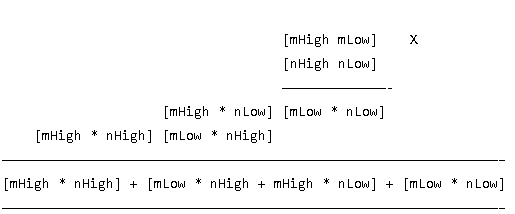

# 16 bit classic multiplier in VHDL
This contains the classic 8 bit and 16 bit multiplier.  
The 8 bit was made using only full adders,then I used four of 8 bit multiplier to make a 16 bit multiplier using the algortihm in the image below.  
  
Where mLow and nLow are the 8 LSB of the 16 bit numbers, while mHigh and nHigh represent the 8 MSB.  
I made this multiplier with the purpose to compare it to other  multipliers such as Wallace Tree in term of speed and power consumption performance. 
